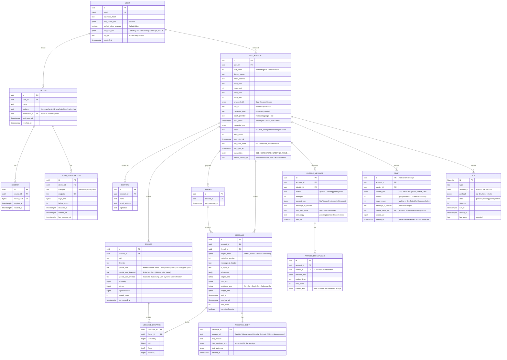

# Datenmodell (Entwurf)

> Status: Ergebnis von Roadmap-Aufgabe **0.4**, abgestimmt mit den ADRs 0001–0011. Grundlage für das Bedrohungsmodell (0.3) und Phase 1. Typen sind PostgreSQL (ADR-0002).
>
> Leitlinie: **so einfach wie möglich.** Was erst später gebraucht wird, kommt erst später ins Modell.

## Ziele

1. **Single-User, getrennte Konten**: Eine Instanz hat einen Benutzer (ADR-0004), das Modell bleibt aber mehrbenutzerfähig. Jede Mail-Entität hängt an genau einem `mail_account`, jeder Account an genau einem `user`. Die Standardansicht ist ein Konto (Thunderbird-artiger Kontowechsel), nicht eine Sammel-Inbox.
2. **IMAP-treu** – Identität einer Nachricht auf dem Server ist `(folder, UIDVALIDITY, UID)`; das Modell bildet das direkt ab.
3. **Der Server speichert alles** (ADR-0001): Bodies und Anhänge werden beim Sync geladen und als verschlüsselte Dateien im Volume `mail-data` abgelegt. In der DB stehen nur Verweise darauf.
4. **Fehlerisolierung pro Konto** – Sync-Zustand, Fehlerzähler und Backoff liegen am Konto bzw. Ordner, nie global.
5. **Inhalte und Secrets nur verschlüsselt** – Zugangsdaten **und alles, was ein Mensch liest** (Betreff, Adressen, Snippet, Body, Dateinamen), liegen verschlüsselt in der DB (siehe [Verschlüsselung](#verschlüsselung)).
6. **Nativer Client später ohne Umbau** – Geräte, Sessions und Push-Subscriptions sind getrennt; Push kennt einen `transport`.

## ER-Diagramm

`*_enc`-Spalten sind verschlüsselt (`bytea`).

## Entitäten im Detail

### Benutzer, Geräte, Sessions

- **`user`**: Anmeldung an der Instanz, nicht an den Mailkonten. Im MVP gibt es genau einen Benutzer, angelegt beim ersten Start. Passwort-Hash (Argon2id); `totp_secret_enc` bleibt bis zu späterer 2FA leer. `unified_inbox_enabled` schaltet die optionale Sammelansicht ein (Default aus).
- **`device`**: gemeinsame Basis für Sessions und Push (ADR-0004). `installation_id` ist die einzige gerätebezogene Kennung im Push-Payload ([push.md](push.md)). Widerruf eines Geräts (`revoked_at`) beendet alle Sessions und deaktiviert alle Subscriptions.
- **`session`**: nur der **Hash** des Tokens wird gespeichert. Ein späterer nativer Client nutzt dieselbe Tabelle mit einem gerätegebundenen Token.
- **`push_subscription`**: `transport` von Anfang an (`webpush`, später `apns`, `relay`). `endpoint` ist eindeutig (Upsert, wenn derselbe Browser sich neu anmeldet); `keys_enc` ist mit dem DEK des Benutzers verschlüsselt (`user.wrapped_dek`, beim ersten Bedarf angelegt). Bei HTTP 404/410 vom Push-Service wird die Zeile direkt gelöscht; `disabled_at` bleibt für spätere Transporte reserviert. Details: [push.md](push.md).

### Konten

- **`mail_account`**: Verbindungsdaten, Anmeldeart (`credential_kind`, `oauth_provider`, siehe ADR-0011), Initial-Sync-Grenze (`sync_since`, pro Konto wählbar), verschlüsselte Zugangsdaten (`credential_enc`), Data Key des Kontos (`wrapped_dek`) und **Konto-Status** mit Backoff-Feldern für Circuit Breaker und Statusanzeige (Roadmap 3.4). `capabilities` wird beim Verbindungstest erfasst und steuert den Sync-Pfad. `sort_order` bestimmt die Reihenfolge im Kontowechsler.
  - Die API darf `credential_enc` nie in Listen- oder Detail-Antworten ausliefern. Dafür ist **ein explizites Spalten-Select** in der Konto-Abfrage Pflicht (kein `SELECT *`).
- **`identity`**: Absenderadressen pro Konto (Roadmap 3.6), je Konto eindeutig (Adresse ohne Groß-/Kleinschreibung). Beim Anlegen wird eine Identität aus `email_address` erzeugt und als `mail_account.default_identity_id` gesetzt; weitere Aliase legt der Benutzer an. Die Standard-Identität kann nicht gelöscht werden.

### Ordner

- **`folder`**: ein IMAP-Mailbox-Eintrag. Ordnerrollen (Roadmap 3.3): `special_use_detected` setzt der Sync aus RFC 6154 bzw. der Namensheuristik (deutsche/englische Ordnernamen, nur für Rollen ohne Attribut), `special_use_override` der Benutzer; `special_use` ist die daraus aufgelöste effektive Rolle (Override vor Erkennung, je Konto höchstens ein Ordner pro Rolle), die alle Aktionen verwenden. Container mit LIST-Flag `\Noselect`/`\NonExistent` (z. B. Gmails `[Gmail]`) haben `selectable = false`: Sie bleiben als Elternknoten im Ordnerbaum, werden aber nicht synchronisiert, bekommen keine Rolle und sind kein Verschiebeziel.
- Der Sync-Zustand liegt **pro Ordner** (`uidvalidity`, `uidnext`, `highestmodseq`). `folder.uidvalidity` ist der Wert, mit dem `message_sync` die Orte zuletzt synchronisiert hat – nur `message_sync` schreibt ihn, `folder_sync` nicht (sonst bliebe eine Änderung unbemerkt). Ändert sich `uidvalidity`, werden alle `message_location`-Zeilen des Ordners mit anderer `uidvalidity` verworfen, die Nachrichten unter ihren neuen UIDs neu geholt (per Message-ID wieder verknüpft) und Nachrichten ohne verbleibenden Ort gelöscht. Inhalte werden immer per UID (`UID FETCH`) geholt, nie per Sequenznummer – ein paralleles EXPUNGE könnte sonst Inhalte vertauschen.

### Nachrichten

Das Modell trennt die **logische Nachricht** von ihrem **Ort auf dem IMAP-Server**:

- **`message`**: Header-Metadaten, einmal pro Konto. Dedupliziert über `message_id_header` (Fallback: Hash aus Datum, Größe und HMAC des Betreffs). `metadata_version` gibt an, mit welchem Stand der Sync-Logik die Metadaten abgeleitet wurden; veraltete Zeilen leitet der Sync in begrenzten Batches neu ab (bevorzugt aus der gespeicherten Rohmail, sonst per IMAP).
- **`message_location`**: `(folder_id, uidvalidity, uid)`, eindeutig. Eine Nachricht kann in mehreren Ordnern liegen (Gmail-Labels, Kopien). **Flags liegen hier**, so wie IMAP sie pro Mailbox führt. Kein zusätzliches aggregiertes Feld; die Ansicht zeigt die Flags des Ordners, in dem man gerade ist.
- **`message_body`**: Die verschlüsselte Rohmail (RFC 822) liegt als Datei im Volume. Der Plaintext für die Anzeige liegt verschlüsselt in der DB, damit das Öffnen schnell ist. Das HTML wird beim Öffnen von der API aus der Rohmail extrahiert und sanitisiert (kein Cache; Volume read-only in der API eingebunden, siehe [security.md](security.md#html-mails)). Rohmails über `MAX_RAW_MESSAGE_BYTES` (Standard 20 MB) oder leere werden nicht gespeichert; sie bekommen eine `message_body`-Zeile ohne `storage_ref` mit `skip_reason` (`too_large`/`empty`), damit der Sync sie nicht bei jedem Lauf erneut lädt.
- **Empfangene Anhänge** (Roadmap 5.3): keine eigene Tabelle. Liste (Name, Typ, Größe) und Inhalt leitet die API beim Abruf aus der verschlüsselten Rohmail ab (MIME-Parser gestreamt, Inhalte anderer Teile werden verworfen), wie beim HTML. Dadurch gibt es keine weitere Kopie, keinen Klartext-Dateinamen in der DB und keinen Backfill für bestehende Mails. `message.has_attachments` (Multipart laut `BODYSTRUCTURE`) ist nur ein Hinweis, ob die Liste geladen wird.
- **`attachment_upload`** (Migration 0017): Anhang zum Versenden, beim Verfassen hochgeladen. Dateiname und Inhalt mit dem Konto-DEK verschlüsselt (AAD `attachment_upload.filename|content:<id>`). Liegt in der DB statt im Volume, weil die API das Volume nur lesend einbindet; Größe begrenzt (`MAX_ATTACHMENT_BYTES`, `MAX_ATTACHMENTS_TOTAL_BYTES`). `POST /api/outbox` bindet Uploads über `outbox_id` an genau eine Nachricht und merkt sich deren Anzahl in `outbox_message.attachment_count` (Migration 0019; fehlt beim Versand ein Upload, schlägt die Nachricht mit `ATTACHMENT_MISSING` fehl statt ohne Anhang zu gehen); der Worker löscht sie, sobald die Nachricht samt Kopie in „Gesendet" erledigt ist. Nicht gesendete Uploads löscht der Client beim Schließen/Verwerfen; nie gebundene Reste löscht der Cleanup-Job nach `UPLOAD_RETENTION_HOURS` (Standard 168 h = 7 Tage, damit offline geschriebene Nachrichten mit Anhängen auch nach längerer Offline-Phase noch gesendet werden können; ist ein Upload beim Senden weg, antwortet `POST /api/outbox` mit `410` und Code `ATTACHMENT_MISSING`, die Offline-Queue speichert den Text dann als Entwurf und bittet, die Anhänge neu hinzuzufügen), Uploads fehlgeschlagener Nachrichten bleiben für einen erneuten Versuch, bis der Outbox-Eintrag nach `OUTBOX_RETENTION_DAYS` (Standard 30 Tage) entfernt wird (Roadmap 5.5).
- **Dateiablage:** Pfad `mail-data/<account_id>/<message_id>/…`. Jede Datei ist mit dem DEK des Kontos verschlüsselt (AEAD, Streaming für große Anhänge).

Archivieren und Verschieben ändern nur `message_location`, nicht `message`.

### Threads

- **`thread`**: **pro Konto**. Gebildet über `References`/`In-Reply-To`, Fallback über den normalisierten Betreff innerhalb eines Zeitfensters (Roadmap 2.5). Weil der Betreff verschlüsselt ist, wird für den Fallback ein HMAC des normalisierten Betreffs (`message.subject_hash`, pro Nachricht, weil das Zeitfenster pro Nachricht gilt) gespeichert. Der Anzeige-Betreff kommt aus der neuesten Nachricht.
- **Algorithmus** (vereinfachtes JWZ, reine Funktion `groupThreads` in `@fma/shared`):
  1. Eine Nachricht gehört zum Thread jeder Message-ID, die sie in `In-Reply-To`/`References` nennt. Fehlende Nachrichten wirken als gemeinsamer Platzhalter-Elternteil; kommt der Elternteil später (z. B. die eigene Antwort in „Gesendet"), werden die Threads zusammengeführt.
  2. Betreff-Fallback nur für Nachrichten **ohne** Referenz-Header mit Antwort-Präfix (Re/AW/Sv …): Anschluss an die nächstgelegene Nachricht mit gleichem normalisiertem Betreff (Präfixe Re/AW/Fwd/WG entfernt) innerhalb von 30 Tagen, frühere bevorzugt. Gleichlautende Mails ohne Antwort-Präfix („Ihre Rechnung") bleiben getrennt.
- Der Worker vergibt `thread_id` nach jedem `message_sync` (älteste zuerst, begrenzt pro Lauf, Advisory-Lock pro Konto) für neue und per Backfill aktualisierte Nachrichten; leere Threads werden beim Entfernen von Nachrichten gelöscht.

### Ansichten

- **Standard:** ein Konto ist aktiv; Ordnerbaum und Liste zeigen nur dessen Daten. Gewechselt wird über den Kontowechsler.
- **Optionale Unified Inbox:** nur wenn `user.unified_inbox_enabled`. Sie ist eine Abfrage über die Inbox-Ordner aller Konten des Benutzers, sortiert nach `thread.last_message_at`, mit Konto-Kennzeichnung. Dafür gibt es keine eigene Tabelle und keine eigene Sync-Logik.

### Versand und Jobs

- **`outbox_message`**: Versandauftrag mit Status und Retry-Zähler (Roadmap 2.7). Gespeichert wird der verschlüsselte Nachrichteninhalt (Absender, Empfänger inkl. Bcc, Betreff, Text als JSON, `content_enc`); der Worker baut daraus bei jedem Versuch die RFC-822-Nachricht mit der einmalig vergebenen `Message-ID`. Der Inhalt wird nach erfolgreichem Versand und Ablage in „Gesendet" gelöscht. `sent_at` markiert die Annahme durch den SMTP-Server – danach wird nie erneut gesendet, nur die Ablage in „Gesendet" wiederholt. `client_id` (optional, UUID des Clients, eindeutig je Konto) macht `POST /api/outbox` wiederholbar: Die Offline-Queue reicht den Versand mit derselben ID nach, ohne doppelt zu senden (Roadmap 4.6).
- **`draft`**: Entwürfe (Roadmap 2.8) liegen auf dem Server, damit sie Reload und Gerätewechsel überstehen. Eigene Tabelle statt `outbox_message` mit Status `draft`: Entwürfe werden oft gespeichert, dürfen unvollständig sein (ohne Empfänger, halbe Adressen) und lösen keinen Versand aus. Die ID erzeugt der Client, Speichern ist ein idempotentes `PUT /api/drafts/:id` (auch aus der Offline-Queue). Inhalt (An/Cc/Bcc als getippter Text, Betreff, Text) mit dem Konto-DEK verschlüsselt (`content_enc`, AAD `draft.content:<id>`), `In-Reply-To`/`References` im Klartext wie bei `message`. `version` steigt bei jedem Speichern; ein Speichern auf Basis einer veralteten Version (anderes Gerät hat inzwischen gespeichert) wird mit `409` und der aktuellen Fassung beantwortet, außer mit `force` (letzter Schreiber gewinnt, nach Rückfrage im UI). Der Worker-Job `draft_sync` spiegelt den Entwurf in den Entwürfe-Ordner des Kontos (APPEND mit `\Draft`, je Version eine neue Message-ID `<draft-id>.<version>@domain`, ältere Kopien per UID gelöscht – gefunden über die Entwurfs-ID in der Message-ID); Autosaves werden dafür 15 s gesammelt. `source_*` zeigt auf den Entwurf eines anderen Programms, der hier zum Bearbeiten geöffnet wurde und beim ersten Hochladen ersetzt wird. Verwerfen und Senden (`POST /api/outbox` mit `draftId`) setzen `deleted_at` und leeren den Inhalt; der Worker entfernt die IMAP-Kopie und löscht dann die Zeile.
- **`job`**: **eine eigene, einfache Tabelle** (Vorschlag in ADR-0003). Worker holen Jobs mit `SELECT … FOR UPDATE SKIP LOCKED`. `account_id` dient der Isolation und den Rate Limits. **Der Payload enthält nur IDs, keine Inhalte**, und `last_error` wird vor dem Speichern redacted.

## Verschlüsselung

Grundregel: **Alles, was ein Mensch liest, ist verschlüsselt. Im Klartext liegt nur, was Sync, Threading und Sortierung technisch brauchen.**

| Klartext                                     | Verschlüsselt                              |
| -------------------------------------------- | ------------------------------------------ |
| IDs, Zeitstempel, Größen, Flags, Ordnerpfade | Betreff, Absender, Empfänger, Snippet      |
| `Message-ID`, `In-Reply-To`, `References`    | Body, Anhang-Dateinamen, Anhang-Inhalte    |
| Kontoserver (Host/Port), Kontostatus         | Zugangsdaten, Outbox-Nachrichten, Entwürfe |
|                                              | TOTP-Secret, Push-Subscription-Keys        |

**Verfahren, einfach gehalten:**

- **Ein Data Key (DEK) pro Mailkonto**, gespeichert als `mail_account.wrapped_dek` und mit dem Master-Key aus der Umgebung gewrappt (`key_id` = Master-Key-Version). Damit werden Zugangsdaten und alle Inhalte des Kontos verschlüsselt (AEAD, z. B. AES-256-GCM, eigener Nonce pro Feld).
- Für benutzerbezogene Secrets (TOTP, Push-Keys) gibt es analog einen DEK pro Benutzer.
- **Formate:** DB-Felder als Text-Envelope `fma.f1.` + base64(Nonce | Ciphertext | Tag); Dateien im Volume (Rohmails) binär als `fma.b1.` | Nonce | Ciphertext | Tag – ohne base64-/UTF-8-Aufblähung, gleiche AAD-Bindung (`message.body:<id>`). Vor dem Binärformat geschriebene Rohmail-Dateien (Text-Envelope) bleiben lesbar (`decryptBytes` erkennt beide).
- **Master-Key-Rotation** wrappt nur die DEKs neu; die Inhalte selbst müssen nicht neu verschlüsselt werden.
- **Konto löschen** heißt den DEK löschen. Übrig gebliebene Ciphertexte, etwa in Backups, sind damit nicht mehr lesbar (Crypto-Shredding).
- `subject_hash` ist ein HMAC mit einem aus dem Konto-DEK abgeleiteten Schlüssel, also kein ungesalzener Hash.

**Folgen:**

- **Keine Suche in der Datenbank** über Betreff, Absender oder Inhalt. Im MVP läuft die Suche über **IMAP `SEARCH` beim Provider** (ADR-0006). Einen eigenen Suchindex gibt es zunächst nicht.
- Sortieren nach Absender oder Betreff ist in SQL nicht möglich. Listen sortieren nach Datum, und das reicht.
- Die API entschlüsselt beim Ausliefern der Listen. Bei Seitengrößen von etwa 50 Einträgen ist das unkritisch.

## Querschnittsregeln

| Regel                   | Umsetzung im Modell                                                                                                                                                                                                                                                                                                                                           |
| ----------------------- | ------------------------------------------------------------------------------------------------------------------------------------------------------------------------------------------------------------------------------------------------------------------------------------------------------------------------------------------------------------- |
| Mandantentrennung       | Jede Mail-Tabelle ist über `account_id` → `user_id` erreichbar; jede API-Abfrage filtert über `user_id`.                                                                                                                                                                                                                                                      |
| Löschen eines Kontos    | `ON DELETE CASCADE` von `mail_account` auf alle abhängigen Tabellen. Der DEK ist damit weg; Dateien im Volume entfernt der Cleanup-Job (Roadmap 3.1, 5.5).                                                                                                                                                                                                    |
| Aufräumen (Cleanup)     | Periodischer `cleanup`-Job (Roadmap 5.5): Mails ohne `message_location` samt Rohmail-Datei, verwaiste Uploads, alte Outbox-Einträge, abgelaufene Sessions, alte Jobs; Volume-Scan löscht Dateien ohne DB-Verweis erst nach einer Schonfrist. Immer erst DB-Zeilen, dann Dateien – ein Absturz hinterlässt höchstens verwaiste Dateien, nie Zeilen ohne Datei. |
| Löschen eines Benutzers | Kaskadiert auf Geräte, Sessions, Subscriptions und Konten.                                                                                                                                                                                                                                                                                                    |
| Dateien im Volume       | Gehören zu genau einem Konto (Pfad mit `account_id`), sind mit dessen DEK verschlüsselt und werden beim Löschen des Kontos mit entfernt.                                                                                                                                                                                                                      |

## Wichtige Indizes (vorläufig)

- `message_location (folder_id, uid)` unique: Sync-Abgleich
- `message_location (folder_id)` + `message (received_at desc)`: Ordnerliste
- `message (account_id, message_id_header)`: Deduplizierung, Threading
- `message (account_id, subject_hash)`, `message (account_id, in_reply_to)`, GIN auf `message (references)`, `message (thread_id)`: Threading
- `mail_account (status, next_retry_at)`: Scheduler für Sync und Backoff
- `job (state, run_at)`: Job-Abholung
- `message_location (message_id)`: Cleanup (Mails ohne Ort) und Kaskade beim Löschen von Mails (Migration 0018)
- `push_subscription (device_id) where disabled_at is null`

## Entscheidungen (2026-10-02)

| Frage                          | Entscheidung                                                                                                                                     |
| ------------------------------ | ------------------------------------------------------------------------------------------------------------------------------------------------ |
| Threads kontoübergreifend?     | **Nein, pro Konto.** Standard sind getrennte Konten mit Kontowechsel; die Unified Inbox ist optional und standardmäßig aus.                      |
| Flags bei Gmail aggregieren?   | **Nein.** Flags bleiben an `message_location`; die Anzeige nimmt die Flags des aktuellen Ordners. Erst nachbessern, wenn es in der Praxis stört. |
| Betreff/Snippet verschlüsseln? | **Ja**, zusammen mit allen anderen lesbaren Inhalten (siehe [Verschlüsselung](#verschlüsselung)).                                                |
| Job-Tabelle                    | **Eine eigene Tabelle** mit `SKIP LOCKED`, keine Bibliothek mit eigenem Schema (ADR-0003).                                                       |
| Suchindex                      | **Kein eigener Index im MVP.** Suche per IMAP `SEARCH` (ADR-0006).                                                                               |
