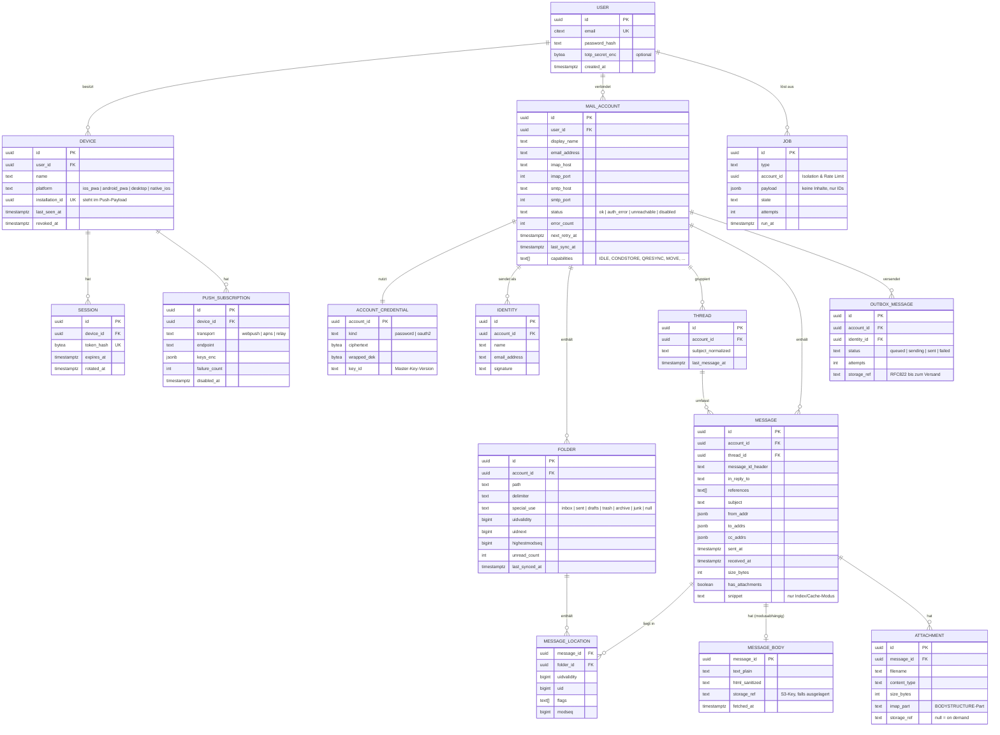

# Datenmodell (Entwurf)

> Status: Entwurf zu Roadmap-Aufgabe **0.4**. Grundlage für ADR-0001 bis ADR-0006 und das Bedrohungsmodell (0.3). Typen sind PostgreSQL-orientiert (ADR-0002, Proposed), aber framework-neutral formuliert.

## Ziele

1. **Multi-Account von Anfang an** – jede Mail-Entität hängt an genau einem `mail_account`, jeder Account an genau einem `user`.
2. **IMAP-treu** – Identität einer Nachricht auf dem Server ist `(folder, UIDVALIDITY, UID)`; das Modell bildet das direkt ab, statt es zu verstecken.
3. **Bodies sind optional** – im Proxy-Modus (ADR-0001) existieren keine Bodies auf dem Server. Bodies, Anhänge und Suchindex liegen daher in eigenen Tabellen.
4. **Fehlerisolierung pro Konto** – Sync-Zustand, Fehlerzähler und Backoff liegen am Konto bzw. Ordner, nie global.
5. **Secrets nur verschlüsselt** – Zugangsdaten liegen ausschließlich als Envelope-verschlüsselter Blob vor (siehe [security.md](security.md)).
6. **Nativer Client später ohne Umbau** – Geräte, Sessions und Push-Subscriptions sind getrennt; Push kennt einen `transport`.

## ER-Diagramm

## Entitäten im Detail

### Benutzer, Geräte, Sessions

- **`user`** – Anmeldung an der Instanz, nicht an den Mailkonten. Passwort-Hash (Argon2id), optional TOTP (verschlüsselt).
- **`device`** – gemeinsame Basis für Sessions und Push (ADR-0004). `installation_id` ist die einzige gerätebezogene Kennung im Push-Payload ([push.md](push.md)). Widerruf eines Geräts (`revoked_at`) beendet alle Sessions und deaktiviert alle Subscriptions.
- **`session`** – nur der **Hash** des Tokens wird gespeichert. Rotation erzeugt eine neue Zeile bzw. aktualisiert `token_hash` + `rotated_at`. Ein späterer nativer Client nutzt dieselbe Tabelle mit einem gerätegebundenen Token.
- **`push_subscription`** – `transport` von Anfang an (`webpush`, später `apns`, `relay`). Bei HTTP 404/410 wird `disabled_at` gesetzt; Cleanup-Job löscht später.

### Konten und Zugangsdaten

- **`mail_account`** – Verbindungsdaten ohne Secrets. Trägt den **Konto-Status** und Backoff-Felder (`error_count`, `next_retry_at`) für Circuit Breaker und UI-Statusanzeige (Roadmap 3.4). `capabilities` wird beim Verbindungstest erfasst und steuert den Sync-Pfad (z. B. QRESYNC vs. Vollabgleich).
- **`account_credential`** – getrennte 1:1-Tabelle, damit Abfragen auf Konten nie versehentlich Secrets laden. Envelope-Encryption: `ciphertext` mit Data Key (DEK) verschlüsselt, DEK mit dem Master-Key gewrappt; `key_id` ermöglicht Key-Rotation. Für OAuth2 (Phase 6) enthält der Klartext Access- und Refresh-Token.
- **`identity`** – Absenderadressen pro Konto (Roadmap 3.6). Für das MVP wird beim Anlegen eine Identität aus `email_address` erzeugt.

### Ordner

- **`folder`** – ein IMAP-Mailbox-Eintrag. `special_use` aus RFC 6154 bzw. Heuristik (Roadmap 3.3).
- Sync-Zustand liegt **pro Ordner**: `uidvalidity`, `uidnext`, `highestmodseq`. Ändert sich `uidvalidity`, werden alle `message_location`-Zeilen des Ordners verworfen und neu synchronisiert.

### Nachrichten

Das Modell trennt die **logische Nachricht** von ihrem **Ort auf dem IMAP-Server**:

- **`message`** – Header-Metadaten, einmal pro Konto. Dedupliziert über `message_id_header` (Fallback: Hash aus Datum, Absender, Betreff, Größe).
- **`message_location`** – `(folder_id, uidvalidity, uid)`, eindeutig. Eine Nachricht kann in mehreren Ordnern liegen (Gmail-Labels, Kopien). **Flags** liegen hier, weil IMAP sie pro Mailbox führt.
- **`message_body`** – nur im Cache-Modus (bzw. bei Index-Modus temporär für die Indexierung). Im Proxy-Modus bleibt die Tabelle leer; die API lädt den Body on demand über den Worker.
- **`attachment`** – Metadaten immer (aus `BODYSTRUCTURE`), Inhalt nur bei gesetztem `storage_ref`.

Archivieren/Verschieben ändert also nur `message_location`, nicht `message`.

### Threads

- **`thread`** – pro Konto, gebildet über `References`/`In-Reply-To`, Fallback normalisierter Betreff innerhalb eines Zeitfensters (Roadmap 2.5).
- Die **Unified Inbox** (3.2) ist eine Abfrage über alle Konten eines Benutzers, sortiert nach `thread.last_message_at` – keine eigene Tabelle.

### Versand und Jobs

- **`outbox_message`** – Versandauftrag mit Status und Retry-Zähler (Roadmap 2.7). Die fertige RFC-822-Nachricht liegt bis zum erfolgreichen Versand und dem Ablegen in „Gesendet" vor und wird danach gelöscht.
- **`job`** – hier nur logisch beschrieben. Ob eine eigene Tabelle oder die Tabelle der Queue-Bibliothek (pg-boss, graphile-worker, Hangfire …) genutzt wird, entscheidet ADR-0003. Pflicht in jedem Fall: `account_id` für Isolation und Rate Limits, **Payload enthält nur IDs, keine Inhalte**.

## Querschnittsregeln

| Regel | Umsetzung im Modell |
| --- | --- |
| Mandantentrennung | Jede Mail-Tabelle ist über `account_id` → `user_id` erreichbar; jede API-Abfrage filtert über `user_id`. |
| Keine Secrets im Klartext | Nur `account_credential`, `user.totp_secret_enc`, `push_subscription.keys_enc` enthalten Secrets – alle verschlüsselt. |
| Löschen eines Kontos | `ON DELETE CASCADE` von `mail_account` auf alle abhängigen Tabellen; Objekte in S3 per Cleanup-Job (Roadmap 3.1, 5.5). |
| Löschen eines Benutzers | Kaskadiert auf Geräte, Sessions, Subscriptions und Konten. |
| Cache-Modus | Metadaten-Tabellen sind modusunabhängig; nur `message_body`, `attachment.storage_ref`, `message.snippet` und Suchindex hängen vom Modus ab. |

## Wichtige Indizes (vorläufig)

- `message_location (folder_id, uid)` unique – Sync-Abgleich
- `message (account_id, message_id_header)` – Deduplizierung, Threading
- `thread (account_id, last_message_at desc)` – Inbox-Listen und Unified Inbox
- `mail_account (status, next_retry_at)` – Scheduler für Sync/Backoff
- `push_subscription (device_id) where disabled_at is null`

## Offene Fragen

1. **Threads kontoübergreifend?** Erhält man dieselbe Mail auf zwei eigenen Adressen, entstehen zwei Threads. MVP-Vorschlag: pro Konto, Unified Inbox zeigt beide mit Konto-Kennzeichnung.
2. **Flags bei Gmail** – dort sind Flags faktisch global. Reicht „Flag am Inbox-Ort ist maßgeblich" für die Anzeige, oder brauchen wir ein aggregiertes `message.is_unread`?
3. **Betreff/Snippet verschlüsseln?** Bisher Klartext in der DB (nötig für Listen und Suche); Schutz über DB-/Volume-Verschlüsselung des Betreibers. Im Bedrohungsmodell (0.3) bewerten.
4. **Job-Tabelle** – eigene vs. Bibliothekstabelle (ADR-0003).
5. **Suchindex** – Spalte `tsvector` an `message` vs. eigene Tabelle `message_search` (ADR-0006); eigene Tabelle passt besser zu „Bodies optional".
