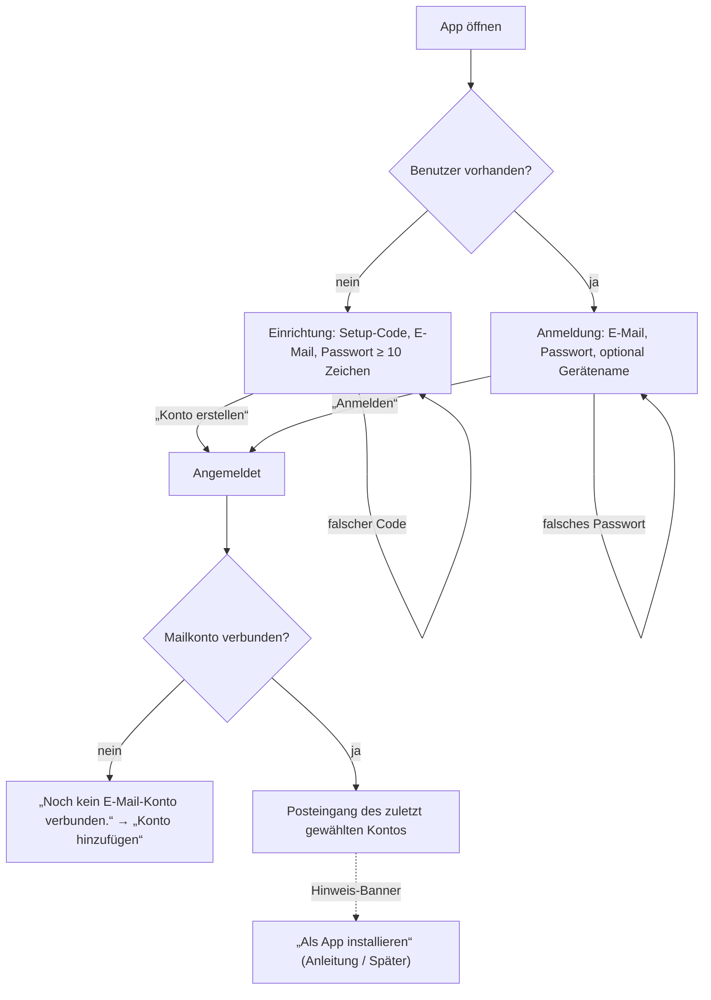
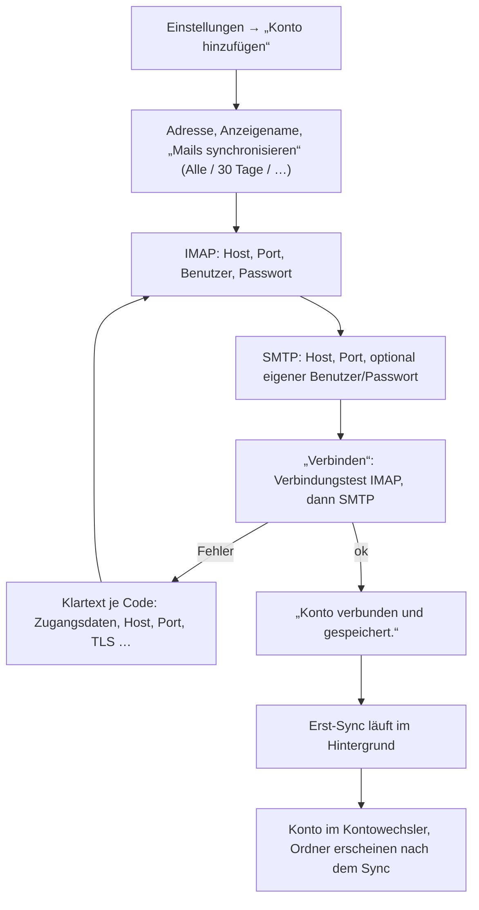
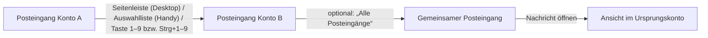
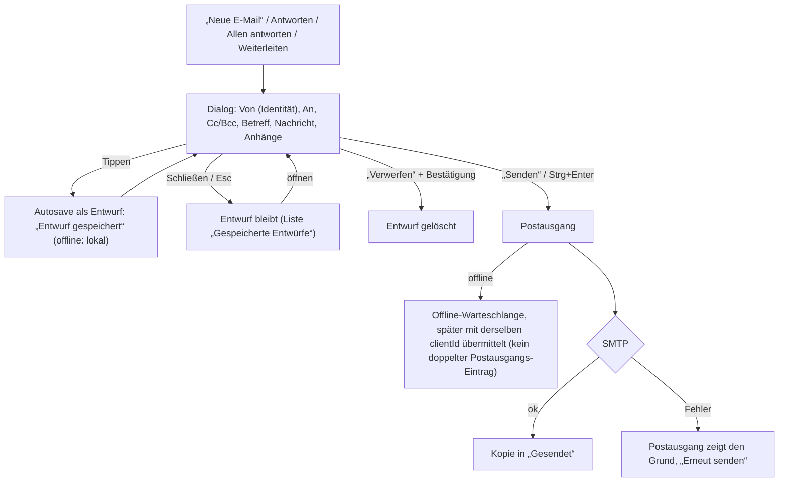
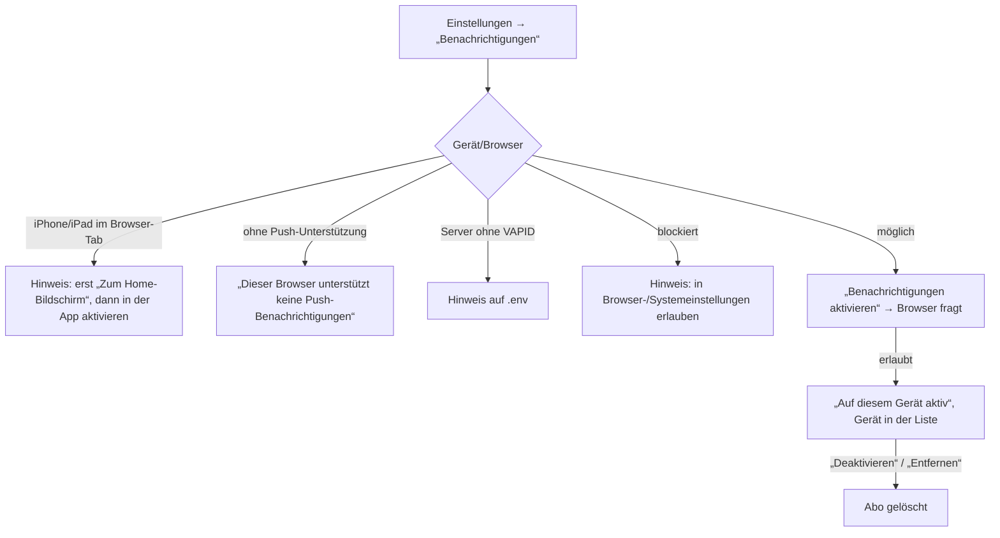

# UX-Flows

Die fünf Kernabläufe der PWA, so wie sie umgesetzt sind (Roadmap 0.6, #19). Bildschirmtexte stehen in „Anführungszeichen“; die ersten vier Abläufe sind im Handy-Viewport per Playwright abgedeckt (`e2e/tests/`, Spec je Abschnitt); Push-Opt-in hat keinen Browser-Test.

## 1. Onboarding: Ersteinrichtung und Anmeldung

- Der Setup-Code steht einmalig im api-Log oder kommt aus `SETUP_TOKEN` ([Installation](../operations/installation.md)). Es gibt genau einen Benutzer (ADR-0004).
- Der Gerätename erscheint später in der Geräteliste und bei den Push-Abos.
- Nach dem Start synchronisiert die App alle Konten (Push ist nur ein Hinweis, Prinzip 3).
- Tests: `e2e/tests/setup.ts`, `password.spec.ts`.

## 2. Konto hinzufügen

- Gespeichert wird nur nach erfolgreichem Test; Zugangsdaten verschlüsselt (Prinzip 5).
- Fehlertexte nennen die Ursache ohne Servertexte: `AUTH_FAILED`, `HOST_NOT_FOUND`, `BLOCKED_HOST`, `BLOCKED_PORT`, `CONNECTION_REFUSED`, `TIMEOUT`, `TLS_ERROR`, `TLS_REQUIRED`.
- Nach dem Speichern fragt die App die Kontoliste bis zu 2 min lang alle 3 s ab, damit das neue Konto ohne Neuladen gefüllt wird.
- Ein halb ausgefülltes Formular geht beim Zurück-Wischen nicht verloren.
- Anbieter-Einstellungen: [Mailanbieter](mail-providers.md). Tests: `setup.ts`, `new-account.spec.ts`, `gestures.spec.ts`.

## 3. Kontowechsel

- Konten bleiben getrennt (Prinzip 8). Beim Wechsel schließen Nachricht, Unterhaltung und Verfassen des alten Kontos; laufende Anfragen werden verworfen, damit sich nie Daten zweier Konten mischen.
- Jedes Konto zeigt seine Ungelesen-Zahl; fehlerhafte Konten ein Abzeichen und ein Banner mit Erklärung und Link zu den Einstellungen.
- Die Auswahl bleibt pro Gerät gespeichert.
- „Alle Posteingänge“ ist standardmäßig aus und wird in den Einstellungen eingeschaltet; Antworten gehen immer aus dem Ursprungskonto.
- Tests: `settings.spec.ts` (gemeinsamer Posteingang), `read.spec.ts`.

## 4. Verfassen (neu, Antworten, Weiterleiten)

- Nur Text (keine HTML-Erstellung). Weiterleiten übernimmt Anhänge und eingebettete Bilder als Anhänge.
- Zwei Geräte am selben Entwurf: Hinweis mit Wahl „andere Fassung laden“ oder „meine behalten“.
- Wischen schließt einen offenen Entwurf nie.
- Tests: `compose.spec.ts`, `gestures.spec.ts`.

## 5. Push-Opt-in

- Immer ausdrücklich pro Gerät; die Browser-Abfrage kommt nur nach einem Tippen (iOS verlangt das).
- Benachrichtigungen enthalten keinen Betreff, Absender oder Inhalt (Prinzip 4); die App lädt die Nachrichten erst nach dem Öffnen.
- Abnahme auf einem echten iOS-Gerät steht noch aus (Roadmap 4.3).

## Offene Produktfragen

Sync-Verhalten direkt nach dem Start und bei offener App: [offene-fragen.md](offene-fragen.md).
